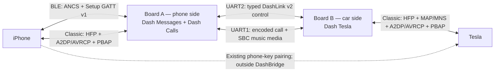
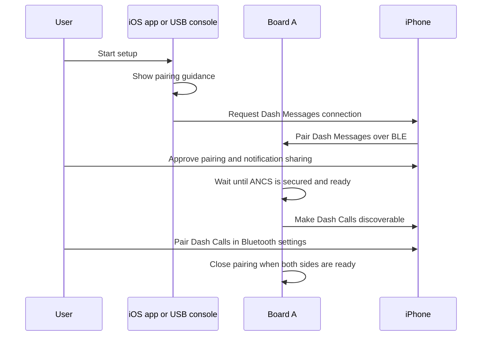

# DashBridge architecture

This is the canonical description of the current two-board architecture. It
explains the Bluetooth identities, functional paths, reconnection rules, source
layout, and compatibility boundaries. It describes the implemented
**0.5.3-alpha** design; passing software validation does not replace the outstanding
iPhone-and-Tesla hardware validation listed in the README.

## System overview

Board A terminates the iPhone-facing Bluetooth services and owns the canonical
phone-side data. Board B projects that state through the Bluetooth profiles the
Tesla already understands. The boards have independent radios so the Tesla can
select Dash Tesla as its active phone while the iPhone remains connected to
Board A. The Tesla phone key stays directly paired to the iPhone and is not
relayed through either board.

The five physical wires are two full-duplex serial links plus ground:

| Link | Pins | Responsibility |
| --- | --- | --- |
| Control | A GPIO17 → B GPIO16 and B GPIO17 → A GPIO16 | Typed, checksummed DashLink v2 messages, state, commands, metadata, contacts, and heartbeats |
| Media | A GPIO25 → B GPIO26 and B GPIO25 → A GPIO26 | Time-sensitive encoded call audio and SBC music frames |
| Reference | GND ↔ GND | Shared signal ground; board power rails are never joined |

Keeping bulk media off the reliable control queue prevents music or call audio
from blocking setup, messages, call commands, contacts, or health heartbeats.

## Bluetooth identities

The names are separate Bluetooth identities, not firmware versions or duplicate
implementations.

| Name | Board and transport | Profiles and purpose | How it is paired |
| --- | --- | --- | --- |
| **Dash Messages** | Board A, Bluetooth Low Energy | Apple ANCS notification access and the released Setup GATT v1 status/policy interface | The companion app normally connects it and iOS asks the user to approve pairing and notification sharing. It can also be paired manually during a USB pairing window. |
| **Dash Calls** | Board A, Bluetooth Classic | HFP calls, A2DP/AVRCP music, and PBAP contacts/call lists | Selected in iPhone Bluetooth settings only after Dash Messages is ready |
| **Dash Tesla** | Board B, Bluetooth Classic | HFP phone/call audio, MAP/MNS messages, A2DP/AVRCP music, and PBAP phonebook projection | Paired once from the Tesla Bluetooth screen |

Dash Messages and Dash Calls must remain distinct because ANCS and app setup
use BLE/GATT, while calls, music, and phonebook access use Bluetooth Classic
profiles. Their state machines remain separate so simultaneous security and
profile negotiations cannot interfere with each other. The staged flow makes
that ordering explicit while preserving every feature.

Dash Messages may not show as continuously “Connected” in iPhone Settings even
when ANCS is operational. Board A's `status` output and the companion app's
profile status are authoritative.

## Functional paths

| Function | iPhone side | Between boards | Tesla side |
| --- | --- | --- | --- |
| Notifications | ANCS events and attributes enter Board A; the saved per-app policy filters and redacts them | Typed notification records on DashLink v2 | Board B exposes a bounded read-only MAP inbox and sends MNS new-message events |
| Recent notifications | Board A silently imports notifications still present through ANCS after reconnect | Same typed notification route, without a new alert | Available in the in-memory MAP inbox; this is not WhatsApp chat history |
| Call control | Board A is the iPhone HFP client | Typed call snapshots and guarded commands | Board B is the Tesla HFP audio gateway |
| Call audio | Encoded HFP audio terminates on Board A | Bidirectional codec-aware media frames on the media UART | Encoded HFP audio terminates on Board B |
| Music | Board A receives iPhone A2DP SBC and AVRCP metadata | SBC frames use the media UART; metadata and controls use DashLink | Board B sends A2DP audio/metadata to the Tesla and returns Tesla AVRCP controls |
| Contacts and call lists | Board A is a PBAP client for contacts, favorites, and incoming/outgoing/missed/combined calls | Sessioned, acknowledged contact transfer on DashLink | Board B is the PBAP server presented to the Tesla |
| Setup | The iOS app uses Setup GATT v1; the USB page uses the serial setup protocol | Status heartbeats allow either board to report the whole bridge | Board B can trigger a local Tesla test message |

Calls own audio focus. Starting a call stops admission of new music audio and
drains queued music; music can resume after call audio ends. This priority is a
portable core rule, not an accidental callback ordering in a Bluetooth adapter.

Messages and contact records are held in bounded RAM structures. Notification
bodies and phonebook contents are not written to flash. Saved Bluetooth bonds
and the notification application policy are persistent configuration.

## Pairing and reconnection

### First-time phone setup

The app shows its approval guidance before it requests the Dash Messages
connection. iOS still owns and presents the Bluetooth-pairing and
notification-sharing prompts. A Board A with no saved BLE bond accepts its
first Dash Messages pairing while it is powered, so first setup is not racing a
boot-time pairing deadline. The user then pairs Dash Calls in iPhone Settings
→ Bluetooth. Without the app, or when replacing an already bonded phone,
`pair phone` opens a 120-second firmware window and the user pairs Dash Messages
first, then Dash Calls. Unknown Classic devices are accepted only while that
window is open and ANCS is already ready. Already bonded devices may reconnect
without reopening pairing.

### Reconnection ownership

Each side has one clear connection owner:

1. Board A actively retries its saved iPhone HFP peer with bounded backoff.
2. Board B remains a listening HFP gateway because the Tesla owns car-side
   reconnection. This prevents competing outgoing connection attempts.
3. HFP establishes the shared Classic base link first.
4. A portable connection coordinator admits only one supplemental Classic
   connection attempt at a time: either A2DP music or PBAP contacts.
5. A profile releases its slot when it connects, fails, disconnects, or times
   out. An HFP base-link loss cancels the in-flight slot and resets the order.
6. Already established profiles continue operating while the other
   supplemental profile is being connected.

BLE/ANCS reconnects through its own state machine and does not compete for the
Classic profile-attempt slot. Heartbeats detect a lost board-to-board link;
session identifiers and replay gates prevent stale call, music, message, or
contact traffic from one connection session from being applied to another.

The coordinator removes a known source of races, but it cannot prove radio,
iOS, or Tesla behavior. Power-cycle, wake-from-sleep, phone-takeover, and
sustained-use tests on physical hardware remain release gates.

## Software architecture

There is one active implementation and one composition root. Firmware owns its
version in `firmware/VERSION`; the iOS app owns its marketing and build versions
in `ios/Config/Version.xcconfig`. Protocol contracts have their own versions,
so either product can be released without changing the other.

| Directory | Responsibility |
| --- | --- |
| `firmware/apps/dashbridge_app` | Selects the Board A or Board B role and composes the product. The only `app_main()` lives here. |
| `firmware/core/dashbridge_domain_core` | Portable state machines and rules for setup, connections, messages, calls, music/audio focus, contacts, and bounded sessions |
| `firmware/core/runtime_ports` | Narrow interfaces through which adapters request time, persistence, pairing state, transport, and coordination effects |
| `firmware/adapters` | iPhone and Tesla Bluetooth behavior: ANCS, Setup GATT, HFP, A2DP/AVRCP, PBAP, and MAP projection |
| `firmware/protocols` | Bounded codecs and schemas for Setup GATT v1, DashLink v2, calls, music, contacts, and OBEX |
| `firmware/transport/dashlink_transport` | Priority queues and delivery of typed control packets between boards |
| `firmware/platform/esp_runtime` | ESP-IDF-specific tasks, locks, UART, timers, NVS, console, and board primitives |
| `contracts/setup_gatt_v1` | Frozen compatibility contract shared by firmware and the released iOS app |
| `ios` | Companion app using only the released Setup GATT contract, not firmware internals |
| `tests` and `tools` | Portable state-machine tests, malformed-input/replay tests, architecture enforcement, builds, packaging, and diagnostics |

Dependency direction is inward: product composition and hardware adapters may
depend on portable core/protocol interfaces; the core may not import ESP-IDF,
FreeRTOS, Bluetooth-stack, adapter, platform, or application headers. Adapters
do not import the application. Bluetooth callbacks report facts to the core;
they do not become competing owners of domain state.

ESP-IDF discovers a single application composition component. DashLink v2
decodes control data directly into explicit heartbeat, notification, call,
music, and contact packets. Real-time media has dedicated codecs and never
enters the control packet variant.

## Compatibility boundaries

The [compatibility matrix](contracts/COMPATIBILITY.md) maps independent product
releases to their protocol contracts. Git tags use `firmware-v<version>` and
`ios-v<version>-b<build>`; matching product version numbers are neither
required nor used as a compatibility signal.

- **iOS:** `contracts/setup_gatt_v1` freezes UUIDs, status bits, command
  operations, encryption requirements, and size limits. The internal firmware
  refactor did not change this released app contract. The app UI changed only
  to guide the staged pairing order.
- **Between boards:** DashLink v2 has a magic/version header, typed domain tag,
  bounded length, and CRC32. A and B images must come from the same release;
  unknown versions or invalid domain states are rejected.
- **Bluetooth:** Profile adapters translate external callbacks into portable
  state. iOS and Tesla profile behavior is treated as an external compatibility
  boundary and must be validated on hardware.
- **USB:** Human and browser commands are documented in
  [the USB command reference](docs/USB_COMMANDS.md). The architecture test
  extracts implemented commands and fails when one is missing from that page.
- **Firmware update:** Full images at `0x0` may clear bonds and policy.
  Application-only images at `0x10000` preserve them only when the installed
  partition layout is known to match.

## Failure containment and edge cases

- Queues, strings, notifications, contact sets, and protocol frames are bounded;
  overload drops work instead of consuming memory without limit.
- Malformed, oversized, wrong-version, wrong-session, reflected, or replayed
  traffic is rejected by codecs and domain gates.
- Loss of the inter-board heartbeat clears projected volatile state instead of
  leaving the Tesla with a falsely live peer.
- Disconnects clear imported message/contact data; persistent delivery and an
  offline outbox are intentionally not promised.
- Call control is prioritized over lower-priority control traffic, and calls
  explicitly preempt music audio.
- A stale profile callback cannot release another profile's active connection
  slot.
- Explicit pairing windows expire after 120 seconds and do not erase existing
  bonds. A Board A with no BLE bond remains eligible for its first Dash Messages
  pairing while powered.
- A physical long-press reset and a full-image flash are destructive recovery
  paths; ordinary pairing and status commands are not.

These rules are exercised by host sanitizer, fragmentation, replay, malformed
input, audio timing, reconnect, architecture, web, and iOS build checks. The
README's project-status table separates that software evidence from confirmed
physical behavior.

## Architectural invariants

The automated architecture check protects the decisions most likely to regress:

- portable core and protocols remain independent of ESP-IDF and adapters;
- only the application composition root wires platform effects together;
- setup state, app policy, profile coordination, and audio focus each have one
  authoritative owner;
- Board A and Board B communicate only through typed DashLink packets or the
  dedicated media codecs;
- Setup GATT v1 stays compatible with the iOS app;
- one application composition root and one product-version source are
  enforced; and
- every implemented USB command remains present in the canonical command page.

When a feature changes, update its portable rule and tests first, then the
relevant protocol/adapter and this document. New behavior must not be introduced
as a second state owner or a second versioned source tree.

The companion app applies the same ownership rule internally. Its reducer,
Bluetooth boundary, persistence boundaries, system-dialog contract, and visual
flow are documented in [`ios/ARCHITECTURE.md`](ios/ARCHITECTURE.md).
