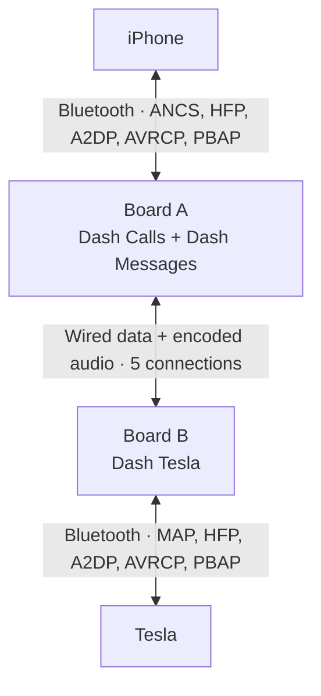

<p align="center">
  
</p>

<p align="center">
  <a href="https://github.com/thomasgregg/DashBridge/actions/workflows/ci.yml"></a>
  
  
  
  <a href="LICENSE"></a>
</p>

<p align="center">
  <a href="#get-started">Get started</a> ·
  <a href="#how-it-works">How it works</a> ·
  <a href="#project-status">Project status</a> ·
  <a href="docs/SETUP.md">Setup guide</a> ·
  <a href="CONTRIBUTING.md">Contribute</a>
</p>

# DashBridge

**An experimental iPhone-to-Tesla Bluetooth bridge.**

Two wired ESP32 boards expose WhatsApp notifications, calls, music, and a phonebook interface to the Tesla. Notifications come from iOS, not a WhatsApp login or a real SMS. The Tesla selects **Dash Tesla as its active phone**; the iPhone connects separately to Board A. The existing Tesla phone-key pairing stays directly on the iPhone.

> [!IMPORTANT]
> **v0.4.0-alpha is a prototype, not a verified daily-use adapter.** The current firmware implements more than the earlier call-only build, but many features have passed only software tests. In the latest hardware check, both boards booted and iPhone notification/music links connected; **all six phonebook/history downloads failed and returned zero records**. Music playback through the Tesla, media buttons, conference controls, and the latest call-audio path still need end-to-end tests. Earlier calls had robotic or unclear audio; do not assume the new audio implementation fixed it. See [what is tested](#project-status) and [how to test](#parked-car-test-checklist).

## Why DashBridge?

The project started with a simple question: can the car's existing message interface display WhatsApp notifications without forwarding them as real SMS messages?

DashBridge explores that through a small, inspectable hardware bridge:

- **Local message transport.** The boards use Bluetooth and a wired connection between them. They do not upload message content.
- **No extra phone messages.** Your original WhatsApp notification remains on the iPhone; DashBridge creates no duplicate SMS or iMessage.
- **No WhatsApp credentials.** Notification access comes from iOS through Apple's notification service, without a linked-device login.
- **Small hardware footprint.** Two original ESP32 development boards, five jumper wires, and USB power.
- **Source you can inspect.** Firmware, protocol handling, tests, build tools, and setup documentation live in this repository.

## How it works



**Board A** receives iPhone notifications through Apple ANCS, filters for WhatsApp and WhatsApp Business, and connects to iPhone call, music, and phonebook services. **Board B** presents a Bluetooth phone, message inbox, music source, and phonebook server to the Tesla. The five wires include separate serial paths for encoded call/music audio and message/control data, plus ground.

The original single-board design delivered notifications but displaced the iPhone as the Tesla's active phone. Two boards give each side its own Bluetooth radio, with the bridge relaying the services between them. Earlier hardware calls exposed audio distortion; the latest audio path has not yet been validated by listening.

The iPhone call and notification connections have reconnected after firmware updates. Broader reconnect, wake-up, and daily-use reliability remain unproven.

See the [call-relay guide](docs/CALL_RELAY.md) for wiring and pairing details and the [implementation notes](docs/DEVELOPMENT.md) for ANCS and MAP. Those guides describe an earlier milestone; this README is the current feature/test snapshot.

## Project status

Snapshot as of **22 September 2026**. The latest paired **development** images tested on hardware were Board A **`0.3.3-alpha+b17b3e8526f7`** and Board B **`0.3.3-alpha+10c949ad3020`**. They built with ESP-IDF v5.5.5, were flashed, and booted after a Board B stack-size fix. The new **0.4.0-alpha release images** in the [manifest](dist/manifest.json) contain the same feature work with a new version identity; they have **not** been installed or end-to-end tested. The manifest's `hardware_tested: false` reflects that limit.

| Feature | Implemented in firmware | Evidence and remaining gap |
| :--- | :--- | :--- |
| WhatsApp messages | ANCS filtering for WhatsApp and WhatsApp Business; read-only Tesla MAP inbox and new-message alerts | Real text appeared on the Tesla in an earlier two-board build. ANCS was linked/encrypted/ready after the latest flash, but fresh end-to-end delivery on these exact images is pending. |
| Recent message history | Silently imports still-present iOS ANCS notifications into the RAM inbox on reconnect | Host tests pass. **Not** full WhatsApp history, and not yet checked on the Tesla with this build. |
| Calls and caller ID | HFP answer, reject/end, dial, DTMF, caller number/name when available, and call-state relay | Answered calls were exercised on earlier builds. Latest build's controls and displayed names need retesting. |
| HD call audio | Encoded mSBC relay at 16 kHz when negotiated; CVSD 8 kHz fallback | mSBC was observed on both Bluetooth sides in prior logs. Earlier listening revealed robotic/unclear audio. New encoded relay builds and boots, but **has not had a listening test or been proven clear**. |
| Call waiting, conference, redial | HFP call-list and hold/multiparty commands, plus last-number redial | Software validation passes. iPhone/Tesla support and real call behavior are unverified. |
| Music and Tesla media buttons | A2DP SBC audio relay; AVRCP play/pause/stop, next/previous, seek, and track/playback metadata | iPhone A2DP/AVRCP linked and metadata callbacks were observed. No streaming audio or Tesla button press was confirmed on the latest images. |
| Contacts, favorites, call lists | PBAP client/server for contacts, favorites, and incoming/outgoing/missed/combined calls; grouped numbers/addresses in vCards | Parser/server tests pass, but the latest iPhone pull failed for **all six repositories**: `entries=0`, `bytes=0`, `discarded=6`. Names, Tesla contact browsing, and redial from history are not demonstrated. |
| Reconnection and sustained use | Bonding and reconnection paths | iPhone call/ANCS links recovered after updates; an earlier Tesla-wake reconnection worked. No extended reliability or phone-key coexistence test on this build. |

`bash tools/test.sh` passes the host checks for notification history, contacts, PBAP, call controls, music control/transport, and audio replay; both firmware targets also built. These are implementation checks, **not** proof that iOS and Tesla expose or accept every feature.

### Current boundaries

- The Tesla selects Dash Tesla as its active phone; it does not keep the iPhone as a second active phone for calls. The phone key remains a separate direct pairing.
- Recent message import means notifications still available through ANCS when Board A reconnects. It does **not** read WhatsApp chats, recover cleared notifications, or persist a backlog through a board restart.
- The inbox holds up to **32 notifications**, with up to **768 UTF-8 bytes** of body per notification; older entries can be evicted. It is read-only: replies and sending WhatsApp messages are not supported.
- Repeated adds and edits to a retained notification ID update its entry without another alert. iOS grouping can affect how many alerts reach the car.
- iPhone previews, Focus settings, locking and app behavior affect the available notification content. Direct pairing in iPhone Settings has worked; no extra iPhone app is needed. Board A has separate call and notification pairings (`Dash Calls` and `Dash Messages`). `Dash Messages` may not display “Connected” in iOS even when ANCS is ready; check Board A's `status` output.
- Music is audio and basic transport/metadata only. Album artwork, browsing the iPhone library/playlists, search, queue management, shuffle, repeat, Siri, and voice-assistant integration are not implemented.
- Call waiting, conference, and redial are conditional on the iPhone/Tesla HFP behavior and remain unverified on real calls. The firmware is not a general-purpose multiparty mixer.

## Hardware

The initial test target is an **iPhone and an approximately 2021 Tesla Model 3**. Earlier notifications worked on that setup; earlier call tests exposed audio quality problems. The latest feature set still needs a complete parked-car test.

| Part | Quantity | Notes |
| :--- | :---: | :--- |
| Original ESP32-WROOM-32 development board | 2 | 4 MB flash; for example, AZDelivery DevKit C V2 |
| USB data cable | As needed | Match the board connector; programming needs a data-capable cable |
| USB power connections | 2 | Power each board independently |
| Female-to-female jumper wire | 5 | Four signal wires and a shared ground |

> **Chip selection matters:** this firmware targets the original `esp32`. ESP32-S2, S3, and C3 boards are not substitutes for the car-facing board, which needs Bluetooth Classic.

### Wiring

Disconnect power before wiring. Label the boards **A — iPhone** and **B — Tesla**.


Shown from above, USB sockets at the bottom. This layout matches the **AZDelivery ESP32 D1 Mini**. Connect matching numbered pins; the GPIO numbers are labelled beside them.


For the **AZDelivery ESP32 Dev Kit C V2 (38 pins, ASIN B074RGW2VQ)**, use this second illustration. It follows the [manufacturer's pinout](https://cdn.shopify.com/s/files/1/1509/1638/files/ESP-32_NodeMCU_Developmentboard_Pinout.pdf?v=1609851295). The two buttons are **EN/RST** (restart) and **BOOT** (programming). Both illustrations use the same wire numbers and GPIO connections, so a D1 Mini and a Dev Kit C V2 can also be paired: use the A view for the board running A firmware and the B view for the board running B firmware. Follow the printed GPIO labels, not the physical positions from the other board's illustration.

| Board A — iPhone | Board B — Tesla |
| :--- | :--- |
| GPIO **17** · TX2 | GPIO **16** · RX2 |
| GPIO **16** · RX2 | GPIO **17** · TX2 |
| GPIO **25** · audio TX | GPIO **26** · audio RX |
| GPIO **26** · audio RX | GPIO **25** · audio TX |
| **GND** | **GND** |

Power both boards over USB. Do **not** connect their 5V, VIN, or 3V3 pins together. Use short wires and follow the [full wiring guide](docs/CALL_RELAY.md#hardware-and-wiring).

## Get started

### 1. Install matching A and B images

[](https://thomasgregg.github.io/DashBridge/)

The public installer supports **Chrome or Edge on a computer**: connect one board by USB, choose its A or B role, click **Install**, and repeat for the other board. It serves the published GitHub build, which **may lag behind this local snapshot**. Check its image versions against the [manifest](dist/manifest.json) before using it to test the features in this README. A full-image installation clears saved pairings.

Prefer a manual installation? [Download the project ZIP](https://github.com/thomasgregg/DashBridge/archive/refs/heads/main.zip), or clone the repository:

```sh
git clone https://github.com/thomasgregg/DashBridge.git
cd DashBridge
```

The local [`dist/`](dist/) directory contains the matching A/B images for this release:

| Board | Firmware | Bluetooth name |
| :--- | :--- | :--- |
| **A — iPhone** | [`phone-merged.bin`](dist/phone-merged.bin) | `Dash Calls` and `Dash Messages` |
| **B — Tesla** | [`car-merged.bin`](dist/car-merged.bin) | `Dash Tesla` |

The [manifest](dist/manifest.json) records versions, image hashes, and source hashes. `phone-merged.bin` and `car-merged.bin` are full images flashed at `0x0`; they can erase Bluetooth pairings. For an update that preserves pairings, use the matching application-only build image at `0x10000` with the existing partition layout. Do not mix a newly built A image with an older B image. The release images build and pass host checks; the **0.4.0-alpha files have not yet been flashed or hardware-tested**.

To install these **exact local images**, use the repository's checksum-checking flash helper with `esptool==4.12.0` in a Python environment. Identify each board's serial port first, then flash them one at a time (replace `YOUR_A_PORT` and `YOUR_B_PORT` with the ports you found):

```sh
python3 tools/flash.py --list
python3 tools/flash.py --board phone --port YOUR_A_PORT
python3 tools/flash.py --board car --port YOUR_B_PORT
```

This is a full-image flash and may require pairing the iPhone and Tesla again. The [setup notes](docs/SETUP.md) explain the application-only layout caveat; never flash an application-only binary at `0x0`.

### 2. Wire and pair the boards

Unplug both boards and connect the five wires shown above. Power them again. In Board A's USB console, enter `pair phone` (a 120-second window) and pair both **Dash Calls** and **Dash Messages** with the iPhone. Allow notification sharing when prompted. In Board B's console, enter `pair car`; pair **Dash Tesla** with the Tesla and enable message and contact syncing where offered. Use `status` on each board to check the actual Bluetooth profile states. The [setup guide](docs/CALL_RELAY.md#first-physical-test-parked) has more pairing detail, though its feature list predates this build.

### 3. Run the parked-car checks

Start with `status` on both boards. Board A should report the iPhone call profile and ANCS ready; Board B should report the Tesla phone/message connections. An iPhone showing `Dash Messages` as not connected is not by itself a failure—Board A's ANCS state is the useful check. Then enter `test` in Board B's **Logs & Console**; a **DashBridge test** message should appear on the Tesla. Send a new WhatsApp notification.

Use the [checklist below](#parked-car-test-checklist) to distinguish visible features from features still awaiting real-device validation. Save logs from **both** boards when something fails; `status` counters and the exact A/B firmware versions help reproduce it.

### Parked-car test checklist

Test only while parked, with the iPhone, both boards, and the Tesla connected. Check each item independently; a Bluetooth link alone does not mean its data path works.

1. **Messages:** confirm Board B's `test` message, then a new WhatsApp notification. Leave another notification in iPhone Notification Center, reconnect Board A, and check whether it appears as silent recent history in the Tesla inbox. Cleared/older chats are outside this feature.
2. **Calls and audio:** receive a call, answer/end from the Tesla, and listen in both directions for at least a few minutes. Try a normal outgoing call and note whether HD/mSBC or CVSD was negotiated in each board's logs. Earlier builds had robotic audio; this build still needs a listening verdict.
3. **Music:** start playback on the iPhone, select Dash Tesla Bluetooth audio in the Tesla, and confirm actual speaker sound, title/artist/album, play/pause, next/previous, and seek. Connected A2DP or metadata without sound is only partial success.
4. **Contacts and call lists:** check `status` on Board A for nonzero phonebook `entries` and zero failed/discarded repository pulls. Then look for named contacts, favorites, and incoming/outgoing/missed calls on the Tesla. The last check had `entries=0`, `bytes=0`, `discarded=6`; do not infer success from a connected PBAP link.
5. **Advanced call controls:** only after ordinary calls work, try redial and a real call-waiting/conference scenario if your phone plan and Tesla expose those controls. Record each result separately; these paths have software tests but no confirmed Tesla result.
6. **Reconnect:** power-cycle each board, then wake/reconnect the Tesla and verify messages, calls, and music again. Check that the separate phone key still behaves as expected.

If contact downloads still fail, capture Board A's PBAP/phonebook log and the iPhone/Tesla contact-sharing settings; the problem is not currently diagnosed. Avoid putting real phone numbers or message bodies in a public issue.

## Build from source

Use **ESP-IDF v5.5.5** targeting the original `esp32`. The pinned SDK revision is [`b774170`](https://github.com/espressif/esp-idf/tree/b774170ff46c393eeb5e495ea37936038d3f4f4f).

After [installing ESP-IDF](https://docs.espressif.com/projects/esp-idf/en/v5.5.5/esp32/get-started/index.html) and activating its environment, run from the repository root:

```sh
# Host tests: requires Clang with AddressSanitizer and UndefinedBehaviorSanitizer.
bash tools/test.sh

# Build and package firmware for both boards, even if an image looks current.
bash tools/build.sh both

# Or build only stale roles (default), or one board.
bash tools/build.sh
bash tools/build.sh phone
bash tools/build.sh car
```

Build outputs stay in `build/`. Packaged full flash images and their manifest are written to `dist/`; `build/phone/dashbridge.bin` and `build/car/dashbridge.bin` are the application-only binaries. The [CI workflow](.github/workflows/ci.yml) runs host tests and builds stale firmware roles; a green check does not establish hardware compatibility. Rebuilding after source changes gives the images new hashes, so compare the installed firmware versions to the resulting manifest when reporting tests.

## Privacy and data behavior

DashBridge keeps notification content in RAM and on the local Bluetooth/wired links. Phonebook and call-history records fetched from the iPhone are also held in RAM and sent to Board B for the Tesla phonebook service. The firmware does not write message bodies or phonebook contents to logs or flash. Bluetooth bonding keys are stored in board flash so devices can reconnect. The Tesla may retain its own synchronized message/contact cache.

ANCS event headers do not identify the source app, so Board A must request notification attributes before it can filter for WhatsApp. Attributes from other apps are not forwarded to Board B.

Disconnects clear the adapter's message inbox; a board restart also loses any imported recent notifications and fetched phonebook data. Clearing a board cannot guarantee deletion of the Tesla's cache. DashBridge does not dismiss or silence the original WhatsApp notification on the iPhone.

## Roadmap

- [x] Implement local notification filtering and the Tesla message gateway.
- [x] Display a test message and a real WhatsApp notification on the Tesla.
- [x] Implement the two-board call, music, and data transport paths.
- [x] Implement recent ANCS history import, PBAP contacts/favorites/call lists, and basic AVRCP metadata/controls.
- [x] Build both release images and pass host software checks; install and boot the preceding development images.
- [x] Exercise notifications and answered calls on earlier physical builds.
- [ ] Demonstrate clear bidirectional call audio on the current encoded path.
- [ ] Demonstrate music sound and Tesla media controls end to end.
- [ ] Resolve the failed iPhone phonebook/history pulls, then verify names, favorites, and call lists on the Tesla.
- [ ] Flash and verify the release images, then test recent-notification import, redial, call waiting/conference, reconnect, and sustained use.
- [ ] Add configurable notification app selection.

Hardware test results will determine the next changes.

## Contributing

The most valuable contribution right now is a reproducible **hardware test report**. If you have the matching boards and are comfortable with firmware experiments, follow the parked-car test sequence and [report your result](https://github.com/thomasgregg/DashBridge/issues/new?template=hardware-report.yml).

Protocol fixes, parser tests, and documentation improvements are welcome too. Read [CONTRIBUTING.md](CONTRIBUTING.md) for the development workflow and the details to include with a report.

## Documentation

| Guide | What you will find |
| :--- | :--- |
| [Setup](docs/SETUP.md) | Current pairing, installation layout, and links to the parked-car checklist |
| [Implementation](docs/DEVELOPMENT.md) | ANCS, MAP subset, wire format, and state handling; earlier milestone |
| [Validation](docs/CALL_RELAY_VALIDATION.md) | Historical call-audio and hardware results from earlier images |
| [Audio tests](docs/AUDIO_ISOLATION_TESTS.md) | Historical tone/loopback diagnostics; those modes are **not active** in the current encoded-audio image |
| [Sources](docs/SOURCES.md) | Specifications, upstream references, and project provenance |
| [Contributing](CONTRIBUTING.md) | Development workflow and useful hardware reports |

## License and acknowledgments

DashBridge's original source and documentation are available under the [MIT License](LICENSE). ESP-IDF and its components retain their own licenses; see [third-party notices](third_party/README.md).

Built with [Espressif ESP-IDF](https://github.com/espressif/esp-idf) and Apple's [ANCS specification](https://developer.apple.com/library/archive/documentation/CoreBluetooth/Reference/AppleNotificationCenterServiceSpecification/Specification/Specification.html). NotifyDrive's public prototype discussion helped inspire the investigation; DashBridge is an independent implementation, not its published source.

DashBridge is not affiliated with or endorsed by Tesla, Apple, WhatsApp, Meta, or NotifyDrive. Product names belong to their respective owners.
