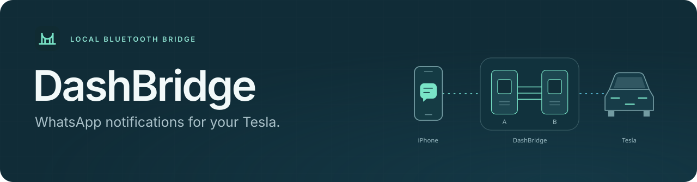
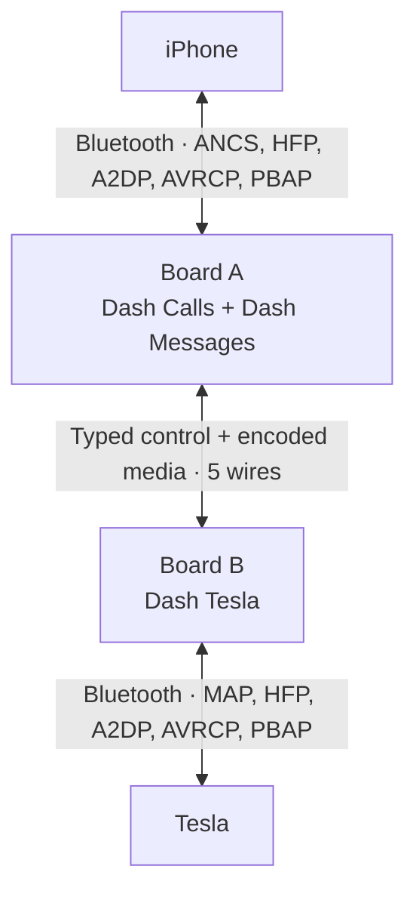
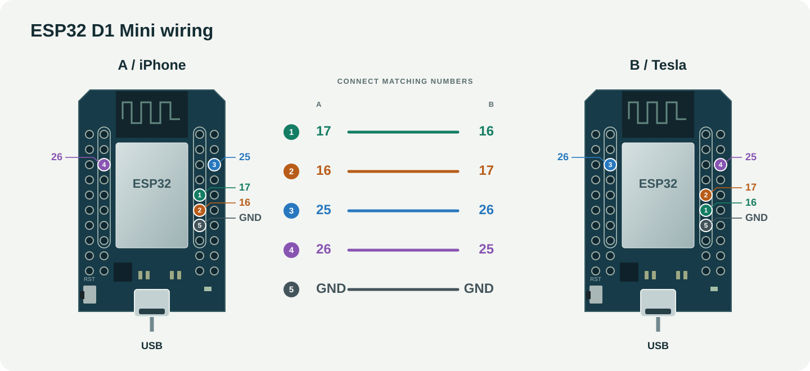
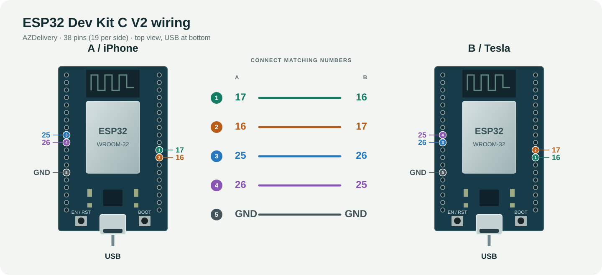

<p align="center">
  
</p>

<p align="center">
  <a href="https://github.com/thomasgregg/DashBridge/actions/workflows/ci.yml"></a>
  
  
  
  <a href="LICENSE"></a>
</p>

<p align="center">
  <a href="#get-started">Get started</a> ·
  <a href="#how-it-works">How it works</a> ·
  <a href="ARCHITECTURE.md">Architecture</a> ·
  <a href="#project-status">Project status</a> ·
  <a href="docs/SETUP.md">Setup guide</a> ·
  <a href="CONTRIBUTING.md">Contribute</a>
</p>

# DashBridge

**An experimental iPhone-to-Tesla Bluetooth bridge.**

Two wired ESP32 boards expose WhatsApp notifications, calls, music, and a phonebook interface to the Tesla. Notifications come from iOS, not a WhatsApp login or a real SMS. The Tesla selects **Dash Tesla as its active phone**; the iPhone connects separately to Board A. The existing Tesla phone-key pairing stays directly on the iPhone.

> [!IMPORTANT]
> **v0.5.3-alpha is a prototype, not a verified daily-use adapter.** Both matching images build and pass software validation, but these exact release images have not been tested end to end with an iPhone and Tesla. Notification delivery, phonebook synchronization, music playback and controls, conference controls, sustained reconnect behavior, and clear bidirectional call audio still require parked-car validation. See [what is validated](#project-status) and [how to test](#parked-car-test-checklist).

## Why DashBridge?

DashBridge answers a simple question: can the car's existing message interface display WhatsApp notifications without forwarding them as real SMS messages?

DashBridge explores that through a small, inspectable hardware bridge:

- **Local message transport.** The boards use Bluetooth and a wired connection between them. They do not upload message content.
- **No extra phone messages.** Your original WhatsApp notification remains on the iPhone; DashBridge creates no duplicate SMS or iMessage.
- **No WhatsApp credentials.** Notification access comes from iOS through Apple's notification service, without a linked-device login.
- **Small hardware footprint.** Two original ESP32 development boards, five jumper wires, and USB power.
- **Source you can inspect.** Firmware, protocol handling, tests, build tools, and setup documentation live in this repository.

## How it works



**Board A** receives iPhone notifications through Apple ANCS and forwards only apps the owner allows. It also connects to iPhone call, music, and phonebook services. **Board B** presents a Bluetooth phone, message inbox, music source, and phonebook server to the Tesla. The five wires include separate serial paths for encoded call/music audio and message/control data, plus ground.

The two boards give the iPhone-facing and Tesla-facing profile groups independent Bluetooth radios. The current audio path has software timing and routing validation but still needs a real listening test.

Initial phone setup is deliberately staged: Dash Messages and notification
sharing finish before Dash Calls becomes discoverable. On reconnect, HFP
establishes the shared Classic link first and a coordinator serializes music and
phonebook connection attempts. These rules prevent concurrent connection attempts, but
wake-up and daily-use reliability still require physical testing.

See the [architecture guide](ARCHITECTURE.md) for every Bluetooth identity,
functional route, pairing/reconnect rule, software layer, and compatibility
boundary. The [setup guide](docs/SETUP.md) covers installation, wiring, pairing,
and the parked-car checks.

## Project status

The **0.5.3-alpha images** in the [manifest](dist/manifest.json) contain the staged pairing and serialized reconnect architecture. They are freshly built, software-validated, and have passed an on-board boot and inter-board-link smoke test. They have **not** been checked with an iPhone and Tesla. The manifest's `hardware_tested: false` records that end-to-end distinction.

| Feature | Implemented in firmware | Evidence and remaining gap |
| :--- | :--- | :--- |
| Allowed-app messages | No apps allowed by default on new setups; per-app choices; read-only Tesla MAP inbox and new-message alerts | Policy, privacy, MAP, and transport validation passes; real notification delivery and new-app discovery are pending. |
| Recent notifications | Silently imports still-present iOS ANCS notifications into the RAM inbox on reconnect | State and protocol validation passes; this is not WhatsApp chat history and still needs a Tesla check. |
| Calls and caller ID | HFP answer, reject/end, dial, DTMF, caller number/name when available, and call-state relay | Command, state, codec, and transport validation passes; real call behavior is pending. |
| HD call audio | Encoded mSBC relay at 16 kHz when negotiated; CVSD 8 kHz fallback | Timing, routing, isolation, and replay validation passes; clear bidirectional sound is not yet demonstrated. |
| Call waiting, conference, redial | HFP call-list and hold/multiparty commands, plus last-number redial | Software validation passes. iPhone/Tesla support and real call behavior are unverified. |
| Music and Tesla media buttons | A2DP SBC audio relay; AVRCP play/pause/stop, next/previous, seek, and track/playback metadata | State, control, metadata, audio-focus, and media-transport validation passes; speaker sound and real buttons are pending. |
| Contacts, favorites, call lists | PBAP client/server for contacts, favorites, and incoming/outgoing/missed/combined calls; grouped numbers/addresses in vCards | Parser, transfer, and server validation passes; iPhone download and Tesla browsing are pending. |
| Pairing and reconnection | Staged BLE-before-Classic setup; known-bond checks; active iPhone HFP retry; passive Tesla gateway; one-at-a-time A2DP/PBAP connection coordination | Ordering, timeout, reset, persistence, and replay validation passes; power-cycle, Tesla-wake, phone-takeover, and sustained use are pending. |

`bash tools/validate_host.sh` passes the architecture and host validation for notifications, contacts, PBAP, call controls, music control/transport, malformed input, reconnect policy, and audio replay; both firmware targets also build. This is implementation evidence, **not** proof that iOS and Tesla expose or accept every feature.

### Operational model and limits

- **Bluetooth roles:** the Tesla uses Dash Tesla for calls, messages, music, and contacts. The iPhone connects to Dash Messages over BLE and Dash Calls over Bluetooth Classic. Its separate Tesla phone-key pairing remains direct and outside DashBridge.
- **Pairing order:** The companion app presents Apple's accessory picker after the user taps Connect; it pairs Dash Messages and bridges Dash Calls through the same system-owned setup. Dash Calls remains hidden from ordinary discovery until notification sharing is ready. Manual USB setup uses `pair phone` on Board A and `pair car` on Board B.
- **Messages:** the inbox is a read-only, in-memory projection of current ANCS notifications, not a WhatsApp client or durable archive. It holds 32 items with bodies bounded to 768 UTF-8 bytes; a restart or disconnect can clear it.
- **Calls and music:** calls have audio priority over music. HFP features such as call waiting, conference, and redial are forwarded only when the connected devices advertise support. Music includes SBC audio, standard AVRCP controls, and track metadata.
- **Contacts:** contacts, favorites, and call lists are fetched through PBAP and kept in memory. Availability depends on the permissions and repositories exposed by the iPhone and accepted by the Tesla.
- **Hardware evidence:** software validation checks state, protocols, timing, bounds, and recovery. Only a physical iPhone/Tesla test can establish radio interoperability, audible quality, and daily reconnect behavior.

## Hardware

The initial test target is an **iPhone and an approximately 2021 Tesla Model 3**. The current release still needs a complete parked-car test.

| Part | Quantity | Notes |
| :--- | :---: | :--- |
| Original ESP32-WROOM-32 development board | 2 | 4 MB flash; for example, AZDelivery DevKit C V2 |
| USB data cable | As needed | Match the board connector; programming needs a data-capable cable |
| USB power connections | 2 | Power each board independently |
| Female-to-female jumper wire | 5 | Four signal wires and a shared ground |

> **Chip selection matters:** this firmware targets the original `esp32`. ESP32-S2, S3, and C3 boards are not substitutes for the car-facing board, which needs Bluetooth Classic.

### Wiring

Disconnect power before wiring. Label the boards **A — iPhone** and **B — Tesla**.



Shown from above, USB sockets at the bottom. This layout matches the **AZDelivery ESP32 D1 Mini**. Connect matching numbered pins; the GPIO numbers are labelled beside them.



For the **AZDelivery ESP32 Dev Kit C V2 (38 pins, ASIN B074RGW2VQ)**, use this second illustration. It follows the [manufacturer's pinout](https://cdn.shopify.com/s/files/1/1509/1638/files/ESP-32_NodeMCU_Developmentboard_Pinout.pdf?v=1609851295). **EN/RST** always restarts the board. **BOOT/GPIO0** selects programming mode during startup and, while DashBridge is already running, acts as the setup button: hold it for 2 seconds to open pairing or 8 seconds to erase that board's pairing and restart it; a short press on Board B sends the Tesla test notification when the message channel is ready. Both illustrations use the same wire numbers and GPIO connections, so a D1 Mini and a Dev Kit C V2 can also be paired: use the A view for the board running A firmware and the B view for the board running B firmware. Follow the printed GPIO labels, not the physical positions from the other board's illustration.

| Board A — iPhone | Board B — Tesla |
| :--- | :--- |
| GPIO **17** · TX2 | GPIO **16** · RX2 |
| GPIO **16** · RX2 | GPIO **17** · TX2 |
| GPIO **25** · audio TX | GPIO **26** · audio RX |
| GPIO **26** · audio RX | GPIO **25** · audio TX |
| **GND** | **GND** |

Power both boards over USB. Do **not** connect their 5V, VIN, or 3V3 pins together. Use short wires and follow the [setup guide](docs/SETUP.md).

## Get started

### 1. Install matching A and B images

[](https://thomasgregg.github.io/DashBridge/)

The public installer supports **Chrome or Edge on a computer**: connect one board by USB, choose its A or B role, click **Install**, and repeat for the other board. Check its displayed release against the [manifest](dist/manifest.json) before flashing; the public site may take a few minutes to update after a release. A full-image installation may clear saved pairings and app choices.

Prefer a manual installation? [Download the project ZIP](https://github.com/thomasgregg/DashBridge/archive/refs/heads/main.zip), or clone the repository:

```sh
git clone https://github.com/thomasgregg/DashBridge.git
cd DashBridge
```

The local [`dist/`](dist/) directory contains the matching A/B images for this release:

| Board | Firmware | Bluetooth name |
| :--- | :--- | :--- |
| **A — iPhone** | [`phone-full.bin`](dist/phone-full.bin) | `Dash Calls` and `Dash Messages` |
| **B — Tesla** | [`car-full.bin`](dist/car-full.bin) | `Dash Tesla` |

The [manifest](dist/manifest.json) records versions, image hashes, and source hashes. `phone-full.bin` and `car-full.bin` contain the bootloader, partition table, and application and are flashed at `0x0`; they can erase Bluetooth pairings and app choices. For an update that preserves pairings, use the matching application-only build image at `0x10000` only after confirming the existing partition layout matches. Always install A and B from the same manifest. These **0.5.3-alpha images have passed an on-board boot and inter-board-link smoke test, but not an end-to-end iPhone/Tesla test**.

To install these **exact local images**, use the repository's checksum-checking flash helper with `esptool==4.12.0` in a Python environment. Identify each board's serial port first, then flash them one at a time (replace `YOUR_A_PORT` and `YOUR_B_PORT` with the ports you found):

```sh
python3 tools/flash.py --list
python3 tools/flash.py --board phone --port YOUR_A_PORT
python3 tools/flash.py --board car --port YOUR_B_PORT
```

This is a full-image flash and may require pairing the iPhone and Tesla again. The [setup notes](docs/SETUP.md) explain the application-only layout caveat; never flash an application-only binary at `0x0`.

### 2. Wire and pair the boards

Unplug both boards and connect the five wires shown above. Power them again. With the companion app, tap **Connect my iPhone** and approve Apple's accessory picker and notification-sharing prompts; the picker includes Dash Calls for calls and music. Without the app, enter `pair phone` on Board A, pair **Dash Messages** first, allow notification sharing, and then select **Dash Calls** in iPhone Bluetooth settings when it appears. On Board B enter `pair car`, pair **Dash Tesla** with the Tesla, and enable message and contact syncing where offered. The native iPhone companion app is currently available only through internal TestFlight testing and can choose apps returned by iOS; the [USB setup page](https://thomasgregg.github.io/DashBridge/setup.html) remains available in Chrome or Edge for pairing controls, diagnostics, and learning an app from a fresh notification. See the [setup guide](docs/SETUP.md) for the complete sequence and the [USB command reference](docs/USB_COMMANDS.md) for every console command.

### 3. Run the parked-car checks

Start with `status` on both boards. Board A should report the iPhone call profile and ANCS ready; Board B should report the Tesla phone/message connections. An iPhone showing `Dash Messages` as not connected is not by itself a failure—Board A's ANCS state is the useful check. Then enter `test` in Board B's **Logs & Console**; a **DashBridge test** message should appear on the Tesla. Send a new WhatsApp notification.

Use the [checklist below](#parked-car-test-checklist) to distinguish visible features from features still awaiting real-device validation. Save logs from **both** boards when something fails; `status` counters and the exact A/B firmware versions help reproduce it.

### Parked-car test checklist

Test only while parked, with the iPhone, both boards, and the Tesla connected. Check each item independently; a Bluetooth link alone does not mean its data path works.

1. **Messages:** confirm Board B's `test` message, then a new WhatsApp notification. Leave another notification in iPhone Notification Center, reconnect Board A, and check whether it appears silently in the Tesla inbox. Cleared chats are outside this feature because ANCS is not a chat archive.
2. **Calls and audio:** receive a call, answer/end from the Tesla, and listen in both directions for at least a few minutes. Try a normal outgoing call and note whether HD/mSBC or CVSD was negotiated in each board's logs.
3. **Music:** start playback on the iPhone, select Dash Tesla Bluetooth audio in the Tesla, and confirm actual speaker sound, title/artist/album, play/pause, next/previous, and seek. Connected A2DP or metadata without sound is only partial success.
4. **Contacts and call lists:** check `status` on Board A for nonzero phonebook `entries` and zero failed/discarded repository pulls. Then look for named contacts, favorites, and incoming/outgoing/missed calls on the Tesla. Do not infer success from a connected PBAP link alone.
5. **Advanced call controls:** only after ordinary calls work, try redial and a real call-waiting/conference scenario if your phone plan and Tesla expose those controls. Record each result separately; these paths have software tests but no confirmed Tesla result.
6. **Reconnect:** power-cycle each board, then wake/reconnect the Tesla and verify messages, calls, and music again. Check that the separate phone key still behaves as expected.

If contact downloads fail, capture Board A's PBAP/phonebook log and the iPhone/Tesla contact-sharing settings. Avoid putting real phone numbers or message bodies in a public issue.

## Build from source

Use **ESP-IDF v5.5.5** targeting the original `esp32`. The pinned SDK revision is [`b774170`](https://github.com/espressif/esp-idf/tree/b774170ff46c393eeb5e495ea37936038d3f4f4f).

After [installing ESP-IDF](https://docs.espressif.com/projects/esp-idf/en/v5.5.5/esp32/get-started/index.html) and activating its environment, run from the repository root:

```sh
# Validate architecture and host code with ASan/UBSan (clang++ by default).
bash tools/validate_host.sh

# Build and package firmware for both boards, even if an image looks current.
bash tools/build.sh both

# Or build only stale roles (default), or one board.
bash tools/build.sh
bash tools/build.sh phone
bash tools/build.sh car
```

Build outputs stay in `build/`. Packaged full flash images and their manifest are written to `dist/`; `build/phone/dashbridge.bin` and `build/car/dashbridge.bin` are the application-only binaries. The [CI workflow](.github/workflows/ci.yml) runs host validation and builds stale firmware roles; a green check does not establish hardware compatibility. Rebuilding after source changes gives the images new hashes, so compare the installed firmware versions to the resulting manifest when reporting results.

## Privacy and data behavior

DashBridge keeps notification content in RAM and on the local Bluetooth/wired links. Phonebook and call-history records fetched from the iPhone are also held in RAM and sent to Board B for the Tesla phonebook service. The firmware does not write message bodies or phonebook contents to logs or flash. Bluetooth bonding keys are stored in board flash so devices can reconnect. The Tesla may retain its own synchronized message/contact cache.

ANCS event headers do not identify the source app, so Board A must request notification attributes before it can filter for WhatsApp. Attributes from other apps are not forwarded to Board B.

Disconnects clear the adapter's message inbox; a board restart also loses any imported recent notifications and fetched phonebook data. Clearing a board cannot guarantee deletion of the Tesla's cache. DashBridge does not dismiss or silence the original WhatsApp notification on the iPhone.

## Roadmap

- [x] Implement local notification filtering and the Tesla message gateway.
- [x] Display a test message and a real WhatsApp notification on the Tesla.
- [x] Implement the two-board call, music, and data transport paths.
- [x] Implement recent ANCS history import, PBAP contacts/favorites/call lists, and basic AVRCP metadata/controls.
- [x] Build both release images and pass host software validation.
- [ ] Demonstrate clear bidirectional call audio on the current encoded path.
- [ ] Demonstrate music sound and Tesla media controls end to end.
- [ ] Verify names, favorites, and call lists on the Tesla.
- [ ] Flash and verify the release images, then validate recent-notification import, redial, call waiting/conference, reconnect, and sustained use.
- [x] Add configurable notification app selection.

Hardware test results will determine the next changes.

## Releases

Firmware and the iPhone app are released independently from this repository.
The two board images remain one firmware release because their internal
DashLink protocol and physical connection must match.

- Firmware version: `firmware/VERSION`; tag: `firmware-v<version>`
- iOS version and build: `ios/Config/Version.xcconfig`; tag:
  `ios-v<version>-b<build>`
- Shared app/firmware compatibility: `contracts/setup_gatt_v1`

A compatible firmware or app change does not require releasing the other
product. A shared-contract change is checked against both products before it
can merge. The [compatibility matrix](contracts/COMPATIBILITY.md) records the
supported combinations.

## Contributing

The most valuable contribution right now is a reproducible **hardware test report**. If you have the matching boards and are comfortable with firmware experiments, follow the parked-car test sequence and [report your result](https://github.com/thomasgregg/DashBridge/issues/new?template=hardware-report.yml).

Protocol fixes, parser tests, and documentation improvements are welcome too. Read [CONTRIBUTING.md](CONTRIBUTING.md) for the development workflow and the details to include with a report.

## Documentation

| Guide | What you will find |
| :--- | :--- |
| [Firmware release](docs/FIRMWARE_RELEASE.md) | Matching board images, hashes, software validation, and remaining hardware checks |
| [iOS release](docs/IOS_RELEASE.md) | App version, firmware compatibility, and physical-device validation status |
| [Compatibility](contracts/COMPATIBILITY.md) | Which independent firmware and app releases work together |
| [Architecture](ARCHITECTURE.md) | Boards, Bluetooth identities, feature routes, pairing/reconnect rules, code layers, and compatibility boundaries |
| [Setup](docs/SETUP.md) | Current pairing, installation layout, and links to the parked-car checklist |
| [USB commands](docs/USB_COMMANDS.md) | Complete interactive console and browser setup command reference |
| [Audio tests](docs/AUDIO_ISOLATION_TESTS.md) | Current call tone/loopback diagnostics, limits, expected routes, and interpretation |
| [Sources](docs/SOURCES.md) | Specifications, upstream references, and project provenance |
| [Contributing](CONTRIBUTING.md) | Development workflow and useful hardware reports |

## License and acknowledgments

DashBridge's original source and documentation are available under the [MIT License](LICENSE). ESP-IDF and its components retain their own licenses; see [third-party notices](third_party/README.md).

Built with [Espressif ESP-IDF](https://github.com/espressif/esp-idf) and Apple's [ANCS specification](https://developer.apple.com/library/archive/documentation/CoreBluetooth/Reference/AppleNotificationCenterServiceSpecification/Specification/Specification.html). NotifyDrive's public prototype discussion helped inspire the investigation; DashBridge is an independent implementation, not its published source.

DashBridge is not affiliated with or endorsed by Tesla, Apple, WhatsApp, Meta, or NotifyDrive. Product names belong to their respective owners.
