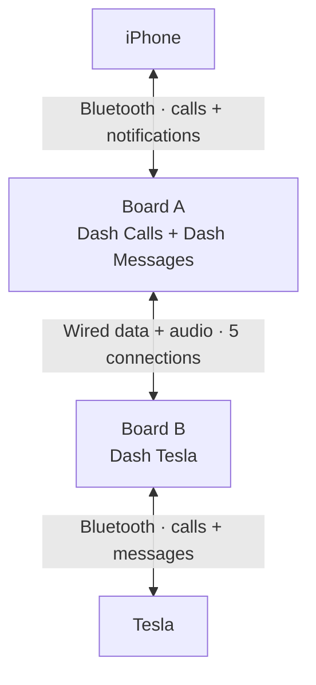

<p align="center">
  
</p>

<p align="center">
  <a href="https://github.com/thomasgregg/DashBridge/actions/workflows/ci.yml"></a>
  
  
  
  <a href="LICENSE"></a>
</p>

<p align="center">
  <a href="#get-started">Get started</a> ·
  <a href="#how-it-works">How it works</a> ·
  <a href="#project-status">Project status</a> ·
  <a href="docs/CALL_RELAY.md">Setup guide</a> ·
  <a href="CONTRIBUTING.md">Contribute</a>
</p>

# DashBridge

**Your iPhone notifications, on your Tesla dashboard.**

Two ESP32 boards connect your iPhone to the Tesla’s Bluetooth message interface. DashBridge forwards new WhatsApp notifications locally—without sending an SMS, signing in to WhatsApp, or routing message content through a server. The new call relay adds phone controls and audio between the same two boards.

> [!IMPORTANT]
> **Call relay alpha · v0.3.3.** Both board images build with ESP-IDF v5.5.5 and software tests pass. WhatsApp text delivery has worked through the two-board setup. Answered calls have been tested, but robotic audio and unclear microphone audio remain unresolved. Music, media controls, contacts and replies are not implemented. The Tesla uses **Dash Tesla as its active phone**, with iPhone calls relayed through Board A. This release includes per-side tone and loopback diagnostics, which remain off until explicitly activated during a call. See the [current test results](docs/CALL_RELAY_VALIDATION.md) and [setup guide](docs/CALL_RELAY.md).

## Why DashBridge?

The project started with a simple question: can the car's existing message interface display WhatsApp notifications without forwarding them as real SMS messages?

DashBridge explores that through a small, inspectable hardware bridge:

- **Local message transport.** The boards use Bluetooth and a wired connection between them. They do not upload message content.
- **No extra phone messages.** Your original WhatsApp notification remains on the iPhone; DashBridge creates no duplicate SMS or iMessage.
- **No WhatsApp credentials.** Notification access comes from iOS through Apple's notification service, without a linked-device login.
- **Small hardware footprint.** Two original ESP32 development boards, five jumper wires, and USB power.
- **Source you can inspect.** Firmware, protocol handling, tests, build tools, and setup documentation live in this repository.

## How it works



**Board A** receives iPhone notifications through Apple ANCS, filters for WhatsApp and WhatsApp Business, and acts as a Bluetooth headset for calls. **Board B** presents a phone and message inbox to the Tesla. Separate wired links carry call audio and message/control data between the boards.

The single-board design delivered WhatsApp notifications but displaced the iPhone’s active phone connection. A message-only experiment did not solve that. This two-board design adds the call relay so the iPhone’s calls can pass through DashBridge. Calls have now been tested on hardware, with unresolved audio distortion in both directions.

The Tesla phone key stays paired directly with the iPhone. DashBridge does not change that pairing. The iPhone call and notification connections have reconnected after firmware updates. Broader reconnect and daily-use reliability remain unproven.

See the [call-relay guide](docs/CALL_RELAY.md) for the architecture and test sequence, and the [notification implementation notes](docs/DEVELOPMENT.md) for ANCS and MAP details.

## Project status

The following describes **0.3.3-alpha** and the observed tests as of **21 September 2026**. Listening results were collected on the development builds listed in the validation record.

| Area | Current state |
| :--- | :--- |
| Firmware builds | Both original-ESP32 targets compile with ESP-IDF v5.5.5; development diagnostic images installed and startup verified on A and B; release rebuild changes only the version identifier |
| Host tests | Notification, call-control, audio transport, tone/loopback and diagnostic-control tests pass with sanitizers |
| WhatsApp delivery | User confirmed text delivery through both boards when Tesla was connected; long-term delivery reliability remains unproven |
| Call controls | Answer, reject/end, explicit-number dialing and DTMF implemented; answered FaceTime Audio calls exercised, but not every control is hardware-verified |
| Call audio | 16 kHz mSBC negotiated on both sides in captured calls; 8 kHz fallback implemented. **Hardware-tested with unresolved robotic/unclear audio** |
| Audio isolation tests | Per-side test tone, loopback and Bluetooth error counters installed; remote stop command verified. **Tone/loopback listening tests pending** |
| Reconnection | iPhone calls and notifications restored after updates; Tesla-owned wake reconnect verified in an earlier B build. Latest B build still awaiting Tesla reconnection/test |
| Daily reliability | **Not established**; no sustained-use validation |
| Music, media controls, contacts and replies | **Not implemented**; fixing call audio does not add music support |

Passing software tests does not establish audio quality or daily reliability. See the [current validation record](docs/CALL_RELAY_VALIDATION.md) for the installed versions and the [audio test guide](docs/AUDIO_ISOLATION_TESTS.md) for pending checks.

### Current boundaries

- This is a **one-call prototype**. Siri, redial, call waiting and conferences are not supported.
- The Tesla selects Dash Tesla as its active phone. It does not keep the iPhone as a second active phone for calls.
- Only new notifications received while the car connection is ready are forwarded. There is no offline backlog or replay of old messages.
- The inbox holds up to **32 notifications**, with up to **768 UTF-8 bytes** of message body per notification.
- Repeated adds and edits to a retained notification ID update its entry without another alert. iOS grouping can affect how many alerts reach the car.
- iPhone previews, Focus settings, locking and app behavior affect the available notification content. Direct pairing in iPhone Settings has worked with the current two-board setup; no extra iPhone app was needed. A has separate call and notification pairings (Dash Calls and Dash Messages).

## Hardware

The initial test target is an **iPhone and an approximately 2021 Tesla Model 3**. Notifications have worked on that setup; call tests have exposed unresolved audio quality problems.

| Part | Quantity | Notes |
| :--- | :---: | :--- |
| Original ESP32-WROOM-32 development board | 2 | 4 MB flash; for example, AZDelivery DevKit C V2 |
| USB data cable | As needed | Match the board connector; programming needs a data-capable cable |
| USB power connections | 2 | Power each board independently |
| Female-to-female jumper wire | 5 | Four signal wires and a shared ground |

> **Chip selection matters:** this firmware targets the original `esp32`. ESP32-S2, S3, and C3 boards are not substitutes for the car-facing board, which needs Bluetooth Classic.

### Wiring

Disconnect power before wiring. Label the boards **A — iPhone** and **B — Tesla**.


Shown from above, USB sockets at the bottom. This layout matches the **AZDelivery ESP32 D1 Mini**. Connect matching numbered pins; the GPIO numbers are labelled beside them.


For the **AZDelivery ESP32 Dev Kit C V2 (38 pins, ASIN B074RGW2VQ)**, use this second illustration. It follows the [manufacturer's pinout](https://cdn.shopify.com/s/files/1/1509/1638/files/ESP-32_NodeMCU_Developmentboard_Pinout.pdf?v=1609851295). The two buttons are **EN/RST** (restart) and **BOOT** (programming). Both illustrations use the same wire numbers and GPIO connections, so a D1 Mini and a Dev Kit C V2 can also be paired: use the A view for the board running A firmware and the B view for the board running B firmware. Follow the printed GPIO labels, not the physical positions from the other board's illustration.

| Board A — iPhone | Board B — Tesla |
| :--- | :--- |
| GPIO **17** · TX2 | GPIO **16** · RX2 |
| GPIO **16** · RX2 | GPIO **17** · TX2 |
| GPIO **25** · audio TX | GPIO **26** · audio RX |
| GPIO **26** · audio RX | GPIO **25** · audio TX |
| **GND** | **GND** |

Power both boards over USB. Do **not** connect their 5V, VIN, or 3V3 pins together. Use short wires and follow the [full wiring guide](docs/CALL_RELAY.md#hardware-and-wiring).

## Get started

### 1. Install from your browser

[](https://thomasgregg.github.io/DashBridge/)

Use **Chrome or Edge on a computer**. Connect one board with a USB data cable, select **A — iPhone** or **B — Tesla**, click **Install**, and select its USB port. The page selects the correct firmware and settings for you. Repeat for the other board. Installation clears the selected board’s saved pairings.

Prefer a manual installation? [Download the project ZIP](https://github.com/thomasgregg/DashBridge/archive/refs/heads/main.zip), or clone the repository:

```sh
git clone https://github.com/thomasgregg/DashBridge.git
cd DashBridge
```

The [`dist/`](dist/) directory contains the prebuilt prototype images:

| Board | Firmware | Bluetooth name |
| :--- | :--- | :--- |
| **A — iPhone** | [`phone-merged.bin`](dist/phone-merged.bin) | `Dash Calls` and `Dash Messages` |
| **B — Tesla** | [`car-merged.bin`](dist/car-merged.bin) | `Dash Tesla` |

The [manifest](dist/manifest.json) records image and source checksums. Board B's Tesla wake reconnect, HFP profile, MAP transport and message notifications have been hardware tested. The complete two-board call/audio relay has been tested together but remains an alpha with unresolved audio distortion. The latest diagnostic listening tests are pending.

### 2. Wire and pair the boards

Unplug both boards and connect the five wires shown above. Power them again, pair **Dash Calls** and **Dash Messages** with the iPhone, then pair **Dash Tesla** with the Tesla and enable message syncing. The [setup guide](docs/CALL_RELAY.md#first-physical-test-parked) covers the pairing commands and notification permissions.

### 3. Test messages, then a call

While parked, open **Logs & Console** for Board B and enter `test`. A message from **DashBridge test** should appear in the Tesla. Then test a new WhatsApp notification.

For the first call test, have someone call the iPhone. Answer on the Tesla and check that you can hear them through the speakers **and they can hear the Tesla microphone**. Save logs from both boards if either direction fails. See the [complete test sequence](docs/CALL_RELAY.md#first-physical-test-parked).

## Build from source

Use **ESP-IDF v5.5.5** targeting the original `esp32`. The pinned SDK revision is [`b774170`](https://github.com/espressif/esp-idf/tree/b774170ff46c393eeb5e495ea37936038d3f4f4f).

After [installing ESP-IDF](https://docs.espressif.com/projects/esp-idf/en/v5.5.5/esp32/get-started/index.html) and activating its environment, run from the repository root:

```sh
# Host tests: requires Clang with AddressSanitizer and UndefinedBehaviorSanitizer.
bash tools/test.sh

# Build and package firmware for both boards.
bash tools/build.sh

# Or build one board only.
bash tools/build.sh phone
bash tools/build.sh car
```

Build outputs stay in `build/`. Packaged flash images and their manifest are written to `dist/`. The [CI workflow](.github/workflows/ci.yml) runs host tests and builds only stale firmware roles; a green check does not establish hardware compatibility.

## Privacy and notification behavior

DashBridge keeps notification content in RAM and on the local Bluetooth/UART links. It does not write message bodies to its logs or flash storage. Bluetooth bonding keys are stored on the boards so paired devices can reconnect.

ANCS event headers do not identify the source app, so Board A must request notification attributes before it can filter for WhatsApp. Attributes from other apps are not forwarded to Board B.

Disconnects clear the adapter's inbox. The Tesla may maintain its own cache; clearing a board cannot guarantee deletion of that cache. DashBridge also does not dismiss or silence the original WhatsApp notification on your iPhone.

## Roadmap

- [x] Implement local notification filtering and the Tesla message gateway.
- [x] Display a test message and a real WhatsApp notification on the Tesla.
- [x] Add the two-board call controls and audio transport.
- [x] Compile both call-relay images and pass software checks.
- [x] Exercise notifications and answered calls with both physical boards.
- [ ] Resolve robotic call audio and unclear microphone delivery.
- [ ] Run the installed per-side tone and loopback listening tests.
- [ ] Validate power cycles, reconnection, audio quality and phone-key coexistence.
- [ ] Add music and media controls.
- [ ] Add contacts and call history.
- [ ] Add configurable notification app selection.

Hardware test results will determine the next changes.

## Contributing

The most valuable contribution right now is a reproducible **hardware test report**. If you have the matching boards and are comfortable with firmware experiments, follow the parked-car test sequence and [report your result](https://github.com/thomasgregg/DashBridge/issues/new?template=hardware-report.yml).

Protocol fixes, parser tests, and documentation improvements are welcome too. Read [CONTRIBUTING.md](CONTRIBUTING.md) for the development workflow and the details to include with a report.

## Documentation

| Guide | What you will find |
| :--- | :--- |
| [Setup](docs/CALL_RELAY.md) | Flashing, pairing, wiring, test sequence, and reset |
| [Implementation](docs/DEVELOPMENT.md) | ANCS, MAP subset, wire format, and state handling |
| [Validation](docs/CALL_RELAY_VALIDATION.md) | Current software evidence, observed hardware results and outstanding tests |
| [Audio tests](docs/AUDIO_ISOLATION_TESTS.md) | Per-side tone and loopback commands, expected sound and diagnostic limits |
| [Sources](docs/SOURCES.md) | Specifications, upstream references, and project provenance |
| [Contributing](CONTRIBUTING.md) | Development workflow and useful hardware reports |

## License and acknowledgments

DashBridge's original source and documentation are available under the [MIT License](LICENSE). ESP-IDF and its components retain their own licenses; see [third-party notices](third_party/README.md).

Built with [Espressif ESP-IDF](https://github.com/espressif/esp-idf) and Apple's [ANCS specification](https://developer.apple.com/library/archive/documentation/CoreBluetooth/Reference/AppleNotificationCenterServiceSpecification/Specification/Specification.html). NotifyDrive's public prototype discussion helped inspire the investigation; DashBridge is an independent implementation, not its published source.

DashBridge is not affiliated with or endorsed by Tesla, Apple, WhatsApp, Meta, or NotifyDrive. Product names belong to their respective owners.
