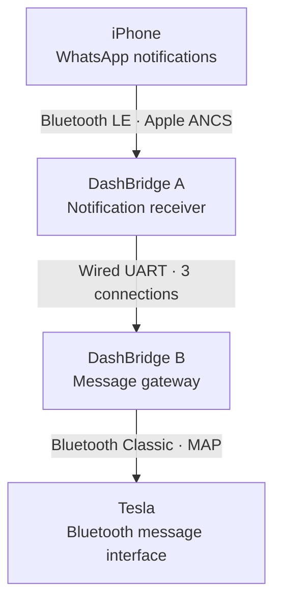

<p align="center">
  
</p>

<p align="center">
  <a href="https://github.com/thomasgregg/DashBridge/actions/workflows/ci.yml"></a>
  
  
  
  <a href="LICENSE"></a>
</p>

<p align="center">
  <a href="#get-started">Get started</a> ·
  <a href="#how-it-works">How it works</a> ·
  <a href="#project-status">Project status</a> ·
  <a href="docs/SETUP.md">Setup guide</a> ·
  <a href="CONTRIBUTING.md">Contribute</a>
</p>

# DashBridge

**A local Bluetooth bridge being built to bring iPhone WhatsApp notifications to your Tesla's message interface.**

Two ESP32 boards sit between your phone's notification service and the car's Bluetooth message inbox. DashBridge copies new notifications locally, without sending an SMS, signing in to WhatsApp, or routing message content through a server.

> [!IMPORTANT]
> **Experimental prototype · hardware compatibility not yet verified.** Both firmware images compile and the host software tests pass. End-to-end behavior on an iPhone and Tesla has not been tested. Calls, music passthrough, and WhatsApp replies are not implemented. Selecting DashBridge as the car's active phone may displace your iPhone for calls. Start with the [parked-car test](docs/SETUP.md#test-1-tesla-with-board-b-alone).

## Why DashBridge?

The project started with a simple question: can the car's existing message interface display WhatsApp notifications without forwarding them as real SMS messages?

DashBridge explores that through a small, inspectable hardware bridge:

- **Local message transport.** The boards use Bluetooth and a wired connection between them. They do not upload message content.
- **No extra phone messages.** Your original WhatsApp notification remains on the iPhone; DashBridge creates no duplicate SMS or iMessage.
- **No WhatsApp credentials.** Notification access comes from iOS through Apple's notification service, without a linked-device login.
- **Small hardware footprint.** Two original ESP32 development boards, three jumper wires, and USB power.
- **Source you can inspect.** Firmware, protocol handling, tests, build tools, and setup documentation live in this repository.

## How it works



**Board A** requests notification access from the iPhone, filters for WhatsApp and WhatsApp Business, and forwards the notification attributes. **Board B** presents a small Bluetooth message inbox and sends new-message events to the car. The diagram shows the intended path; vehicle acceptance is still unverified.

The existing iPhone-to-Tesla phone-key connection remains separate. DashBridge does not modify its pairing. Physical coexistence testing is still on the [validation checklist](docs/VALIDATION.md).

For the protocol details, queue limits, and reconnect behavior, see the [implementation notes](docs/DEVELOPMENT.md).

## Project status

| Area | Current state |
| :--- | :--- |
| Firmware builds | Both original-ESP32 targets compile with ESP-IDF v5.5.1 |
| Host tests | Parser, message handling, and malformed-input tests pass with sanitizers |
| iPhone receiver | ANCS discovery, subscriptions, filtering, and bounded request queue implemented |
| Car gateway | MAP 1.0 subset, message inbox, and new-message events implemented |
| Tesla / iPhone compatibility | **Not hardware-tested** |
| Reconnection and daily reliability | **Not hardware-tested** |
| Calls, music, and replies | **Not implemented** |

“Implemented” means present in the code; it does not mean verified on a device. See the [validation record](docs/VALIDATION.md) for exactly what has and has not been tested.

### Current boundaries

- Only new notifications received while the car connection is ready are forwarded. There is no offline backlog or replay of old messages.
- The inbox holds up to **32 notifications**, with up to **768 UTF-8 bytes** of message body per notification.
- Repeated adds and edits to a retained notification ID update its entry without another new-message alert. iOS grouping can therefore affect how many alerts reach the car.
- iPhone preview permissions, Focus settings, locking, and app behavior can affect what notification content is available.
- The first BLE connection may require a utility such as nRF Connect. Unattended reconnection is not established yet.
- The car-facing profile is a receive-only prototype. Restore your iPhone as the active Bluetooth phone after testing to use normal calls.

## Hardware

The initial test target is an **iPhone and an approximately 2021 Tesla Model 3**. No vehicle or iOS version is confirmed compatible yet.

| Part | Quantity | Notes |
| :--- | :---: | :--- |
| Original ESP32-WROOM-32 development board | 2 | 4 MB flash; for example, AZDelivery DevKit C V2 |
| USB data cable | As needed | Match the board connector; programming needs a data-capable cable |
| USB power connections | 2 | Power each board independently |
| Female-to-female jumper wire | 3 | Two signal wires and a shared ground |

> **Chip selection matters:** this firmware targets the original `esp32`. ESP32-S2, S3, and C3 boards are not substitutes for the car-facing board, which needs Bluetooth Classic.

### Wiring

Disconnect power before wiring. Label the boards **A — iPhone** and **B — Tesla**.

| DashBridge A | DashBridge B |
| :--- | :--- |
| GPIO **17** · TX2 | GPIO **16** · RX2 |
| GPIO **16** · RX2 | GPIO **17** · TX2 |
| **GND** | **GND** |

Power both boards over USB. Do **not** connect their 5V, VIN, or 3V3 pins together. Start the standalone Board B test before joining the boards.

## Get started

### 1. Download the prototype

[Download the project ZIP](https://github.com/thomasgregg/DashBridge/archive/refs/heads/main.zip), or clone the repository:

```sh
git clone https://github.com/thomasgregg/DashBridge.git
cd DashBridge
```

The [`dist/`](dist/) directory contains the prebuilt prototype images:

| Board | Firmware | Bluetooth name |
| :--- | :--- | :--- |
| **B — Tesla** | [`car-merged.bin`](dist/car-merged.bin) | `DashBridge B` |
| **A — iPhone** | [`phone-merged.bin`](dist/phone-merged.bin) | `DashBridge A` |

The [manifest](dist/manifest.json) records image and source checksums. These are experimental builds, not a hardware-validated release.

### 2. Test the car-facing board first

Follow the [setup guide](docs/SETUP.md#load-the-firmware) to flash **Board B**. Pair it with the Tesla, enable message synchronization if offered, then briefly press BOOT to generate a test notification.

**Expected result:** a message from **DashBridge test** appears in the car. This test isolates the most important unknown: whether the Tesla accepts the adapter's message service.

### 3. Connect the iPhone side

Once the car test works, flash **Board A**, pair it with the iPhone, and grant notification access. Connect the three jumper wires and test a new incoming WhatsApp notification.

The [full walkthrough](docs/SETUP.md) covers flashing, pairing, useful serial logs, locked-phone tests, reconnection, and resetting the boards.

## Build from source

Use **ESP-IDF v5.5.1** targeting the original `esp32`. The pinned SDK revision is [`fcae328`](https://github.com/espressif/esp-idf/tree/fcae32885b0296b32044cb99ecbdc50d98dddb83).

After [installing ESP-IDF](https://docs.espressif.com/projects/esp-idf/en/v5.5.1/esp32/get-started/index.html) and activating its environment, run from the repository root:

```sh
# Host tests: requires Clang with AddressSanitizer and UndefinedBehaviorSanitizer.
bash tools/test.sh

# Build and package firmware for both boards.
bash tools/build.sh

# Or build one board only.
bash tools/build.sh phone
bash tools/build.sh car
```

Build outputs stay in `build/`. Packaged flash images and their manifest are written to `dist/`. The [CI workflow](.github/workflows/ci.yml) runs host tests and builds both firmware roles; a green check does not establish hardware compatibility.

## Privacy and notification behavior

DashBridge keeps notification content in RAM and on the local Bluetooth/UART links. It does not write message bodies to its logs or flash storage. Bluetooth bonding keys are stored on the boards so paired devices can reconnect.

ANCS event headers do not identify the source app, so Board A must request notification attributes before it can filter for WhatsApp. Attributes from other apps are not forwarded to Board B.

Disconnects clear the adapter's inbox. The Tesla may maintain its own cache; clearing a board cannot guarantee deletion of that cache. DashBridge also does not dismiss or silence the original WhatsApp notification on your iPhone.

## Roadmap

- [x] Implement bounded notification parsing and local message transport.
- [x] Implement the receive-only Bluetooth message gateway.
- [x] Compile both firmware images and exercise the host protocol tests.
- [ ] Validate the standalone message test on a Model 3.
- [ ] Validate iPhone notification access and real WhatsApp delivery.
- [ ] Test locking, power cycles, grouped messages, and phone-key coexistence.
- [ ] Establish reliable reconnection and simpler first-time setup.
- [ ] Investigate calls and music passthrough after the notification path is proven.

No delivery dates are promised. Hardware observations will determine the next changes.

## Contributing

The most valuable contribution right now is a reproducible **hardware test report**. If you have the matching boards and are comfortable with firmware experiments, start with the Board B test and [report your result](https://github.com/thomasgregg/DashBridge/issues/new?template=hardware-report.yml).

Protocol fixes, parser tests, and documentation improvements are welcome too. Read [CONTRIBUTING.md](CONTRIBUTING.md) for the development workflow and the details to include with a report.

## Documentation

| Guide | What you will find |
| :--- | :--- |
| [Setup](docs/SETUP.md) | Flashing, pairing, wiring, test sequence, and reset |
| [Implementation](docs/DEVELOPMENT.md) | ANCS, MAP subset, wire format, and state handling |
| [Validation](docs/VALIDATION.md) | Software evidence and outstanding hardware tests |
| [Sources](docs/SOURCES.md) | Specifications, upstream references, and project provenance |
| [Contributing](CONTRIBUTING.md) | Development workflow and useful hardware reports |

## License and acknowledgments

DashBridge's original source and documentation are available under the [MIT License](LICENSE). ESP-IDF and its components retain their own licenses; see [third-party notices](third_party/README.md).

Built with [Espressif ESP-IDF](https://github.com/espressif/esp-idf) and Apple's [ANCS specification](https://developer.apple.com/library/archive/documentation/CoreBluetooth/Reference/AppleNotificationCenterServiceSpecification/Specification/Specification.html). NotifyDrive's public prototype discussion helped inspire the investigation; DashBridge is an independent implementation, not its published source.

DashBridge is not affiliated with or endorsed by Tesla, Apple, WhatsApp, Meta, or NotifyDrive. Product names belong to their respective owners.
