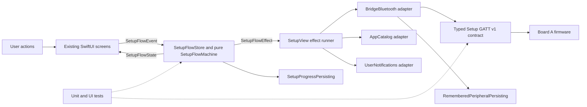
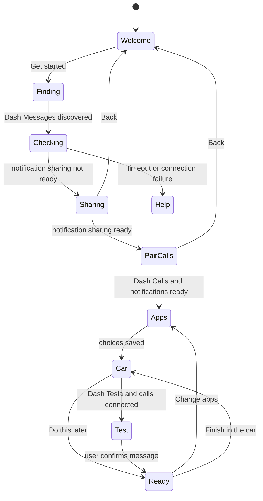

# DashBridge iOS architecture

This document defines the behavior-preserving architecture of the DashBridge
iPhone app. The existing screens, their order, their copy, and the conditions
that trigger iOS-owned permission and pairing dialogs are product compatibility
requirements. Internal changes must preserve those observable behaviors.

## Design goals

1. Keep one authoritative owner for setup navigation and saved setup progress.
2. Keep Core Bluetooth callbacks out of screen-routing decisions.
3. Treat Setup GATT v1 as a released wire contract independent of firmware
   implementation details.
4. Make every setup transition testable without an ESP32, while retaining a
   physical-device release gate for Apple-owned system dialogs.
5. Keep the SwiftUI presentation and accessibility behavior unchanged.

## Component diagram

Dependency direction points away from the screens and toward small interfaces
or pure value types. `SetupFlowMachine` does not import SwiftUI or Core
Bluetooth. `BridgeContract` knows the released UUIDs, status layout, and command
encoding, but not scanning, pairing, timers, or navigation.

## State and effect model

`SetupFlowState` is the single owner of:

- the current screen;
- saved setup progress;
- back-navigation context;
- whether the car screen is being reviewed; and
- whether the explanatory connection screen still needs to trigger a
  connection request.

The view sends a `SetupFlowEvent`. The pure reducer updates state and returns
zero or more `SetupFlowEffect` values. The thin effect runner performs platform
work such as starting Bluetooth, connecting a discovered peripheral, retrying,
or loading the app catalog. Platform callbacks return as new events instead of
mutating navigation directly.

This diagram describes the primary path. The reducer tests also cover returning
users, an already-connected peripheral, saved deferral, review navigation,
device replacement, retries, and cached status arriving before a screen change.

## System-dialog contract

iOS owns the visual presentation and final scheduling of its system dialogs.
The app controls only the operation that may cause a dialog. These trigger
points must not move during refactors.

| System behavior | Application trigger | Required ordering |
| --- | --- | --- |
| Bluetooth application permission | First creation of `CBCentralManager` | Every fresh app session first shows Welcome. Setup and Bluetooth begin only after **Get started**. |
| Dash Messages pairing and notification sharing | `connect(_:options:)` with `CBConnectPeripheralOptionRequiresANCS` | The **Connecting…** guidance is rendered first, followed by the existing short delay, then the connection request. |
| Encrypted policy access | Read the policy characteristic | Only after status reports notification sharing ready, avoiding a competing security exchange. |
| App & Website Usage | Load the installed-app catalog | When entering app selection or the ready screen, never during launch. |
| Local notification permission | Request authorization from `UNUserNotificationCenter` | Only after the user taps **Send test notification**. |
| Dash Calls pairing | User opens iPhone Bluetooth settings | The app reports status and may open the firmware pairing window; it does not attempt to present or imitate Settings. |

Simulator tests verify the app's trigger ordering. They cannot prove whether an
iOS dialog appears. First-pair, denied-permission, previously-paired, and
reconnection cases therefore remain physical-iPhone release checks.

## Setup GATT boundary

`BridgeContract.swift` mirrors `contracts/setup_gatt_v1/contract.json`:

- three fixed characteristic UUIDs;
- an exact three-byte, version-1 status value;
- typed status-bit decoding; and
- typed commands for allow, deny, phone pairing, and notification testing.

Raw operation numbers must not appear in views or Bluetooth lifecycle code.
Any contract version change must update the JSON contract, the typed codec,
firmware validation, compatibility documentation, and contract tests together.

## Persistence

`SetupProgressPersisting` owns the existing user-default keys and stores
onboarding, app-choice completion, Tesla deferral, test confirmation, and the
last completed peripheral identifier. Replacing the physical board keeps the
legacy onboarding marker but resets board-specific completion decisions.

The historical `dashbridge.welcomed` key is retained for compatibility with
installed versions, but it no longer skips Welcome on a fresh app session.

`RememberedPeripheralPersisting` separately owns the Core Bluetooth peripheral
identifier used for reconnection. Keeping this separate prevents transport
caching from becoming setup-flow state.

The existing keys are intentionally unchanged, so the refactor does not reset
installed users.

## Testing and release gates

### Fast automated checks

- `BridgeContractTests` freezes status decoding, exact frame length, contract
  version, and command encoding.
- `SetupFlowTests` exercise navigation and side effects as pure state
  transitions.
- `SetupFlowUITests` retain screen, action placement, back behavior, deferral,
  diagnostics, and preview regression coverage.

### Physical-device matrix

Run these before an iOS release that changes setup, Bluetooth, permissions, or
timing:

1. New installation with Bluetooth permission undecided.
2. Bluetooth denied, then enabled in Settings and retried.
3. First Dash Messages pairing and notification-sharing approval.
4. Notification-sharing denial and subsequent recovery.
5. Dash Calls pairing after Dash Messages becomes ready.
6. Existing bonds after app relaunch and bridge power cycle.
7. Remembered peripheral unavailable, followed by discovery of the live board.
8. Replacement Board A resets board-specific setup progress.
9. Tesla setup deferred, then completed later.
10. Local notification permission allowed and denied from the test screen.

Record the screen visible before each system dialog, the resulting screen, and
the status bits reported by Board A. Simulator success does not replace this
matrix.

## Rules for future changes

- Add new navigation behavior as a state, event, reducer rule, and unit test.
- Add platform work as an effect or adapter operation, not inside a screen.
- Do not route from a Core Bluetooth delegate callback; emit an event instead.
- Do not add another persistence owner for setup progress.
- Do not duplicate Setup GATT UUIDs, bits, or operation numbers.
- Keep user-facing error copy outside the protocol decoder.
- Preserve screen and system-dialog behavior unless a product change explicitly
  authorizes it and updates the compatibility tests and this document.
